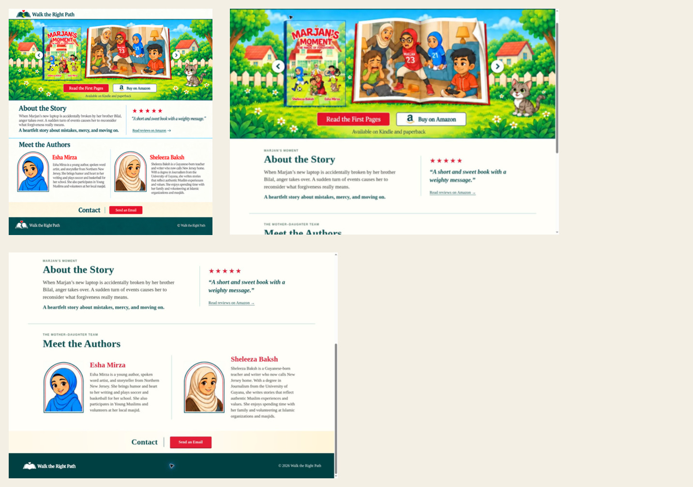

# Design QA

## Evidence

- Reference: selected vertical Walk the Right Path mockup.
- Implementation: live Vite render at `http://terminal.local:4173/`, captured in the managed browser at 1348 × 926.
- Additional browser check: interactive book preview opened and rendered its reduced-resolution images correctly.

## Comparison

- Layout: compact logo header, illustrated hero, story/review band, Esha-first author band, contact strip, and dark footer all match the selected hierarchy.
- Typography: restrained editorial serif typography replaces intense blue copy; headings use forest green, body copy charcoal, and names/actions red.
- Framing: author profile renditions retain the approved arched double-line frame without a decorative background.
- Density: the story and author sections fill their bands without the unwanted blank area from earlier versions.
- Content: no top navigation, separate Books area, activities, reviewer identity, school visits, or event inquiry copy.
- Responsive behavior: grid sections collapse to a single vertical flow below 840 px; portrait/body pairs remain compact at phone widths.
- Accessibility: meaningful image alternatives, labeled hotspot controls, keyboard arrows/Escape in the reader, visible focus styling, and reduced-motion handling.
- Privacy: the source PDF is absent from `public/`; the site ships only six flattened, reduced-resolution, visibly watermarked sample images.

## Functional checks

- Production build: passed.
- Sites worker tests: 4 passed.
- Preview open/close: passed.
- Next/previous controls and page counter: passed.
- Keyboard close: passed.
- Amazon and reviews links: present and target the supplied book listing.
- Site console: no application errors; only unrelated browser-extension metadata warnings were observed.

final result: passed
